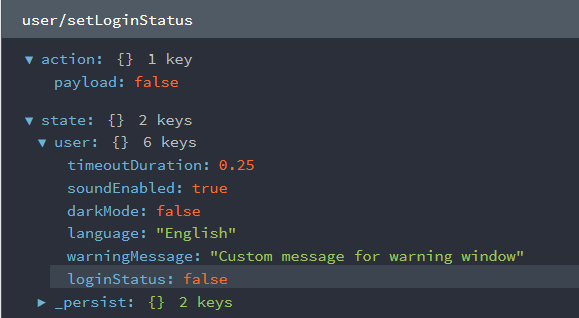

# Idle User Detector

Name: Yash Shinde
email: yash73shinde@gmaiil.com
Phone: 9637128485


[Live Demo](https://idledetect.vercel.app/)

A responsive, accessible React.js application for detecting and handling idle (inactive) users. This project demonstrates advanced React component design, state management, and user experience best practices—all without any backend functionality.

## 🚀 Features

- **Idle Detection:** Tracks user inactivity based on mouse, keyboard, and touch events.

- **Configurable Timeout:** Users can set/select inactivity timeout duration (e.g., 1, 5, 10, 15, 30 minutes, or development seconds).

- **Warning Modal:** Displays a warning modal with a customizable message and a countdown timer before auto-logout.

- **Auto-Logout UI:** Shows a clear message/screen when the user is logged out due to inactivity.

- **Reset Timer:** Inactivity timer resets on any user activity.

- **Pause/Resume Detection:** Controls to pause and resume idle detection.

- **Accessible Design:** All UI elements are accessible (keyboard navigation, ARIA labels, etc.).

- **Responsive Layout:** Fully responsive for desktop and mobile devices.

- **Customizable Warning Message:** Users can set their own warning message.

- **Sound Notification:** Optional sound plays when the warning modal appears.

- **Dark/Light Mode:** Toggle between dark and light themes.

- **Localization:** Supports English and Hindi (language can be switched in settings).

- **Persistent Settings:** All user preferences (including language) are saved and persist across reloads.

## 🖥️ Screenshots

Home Page

   
> 

   Settings


   Warning Window


   Logout Message


   State Management



## 🛠️ Setup Instructions

1. **Clone the repository:**
   ```sh
   git clone git@github.com:yash-73/Idle-User-Detector-DevifyX.git
   cd idleUserDetector
   ```
2. **Install dependencies:**
   ```sh
   npm install
   ```
3. **Start the development server:**
   ```sh
   npm run dev
   ```
4. **Open your browser:**
   Visit [http://localhost:5173](http://localhost:5173) (or the port shown in your terminal).


## 🌐 Localization
- Change language between English and Hindi in the Settings panel.
- All UI text will update instantly.

## 🎨 Theming
- Toggle dark/light mode from the Settings panel or the top-right button.

## 🔊 Sound Notification
- Enable/disable sound for the warning modal in Settings.

## 📝 Custom Warning Message
- Edit the warning message text in Settings. It will appear in the warning modal.

## 📦 Tech Stack
- React.js (with hooks)
- Redux Toolkit & redux-persist
- react-i18next (localization)
- Tailwind CSS (utility-first styling)
- Vite (build tool)

---


